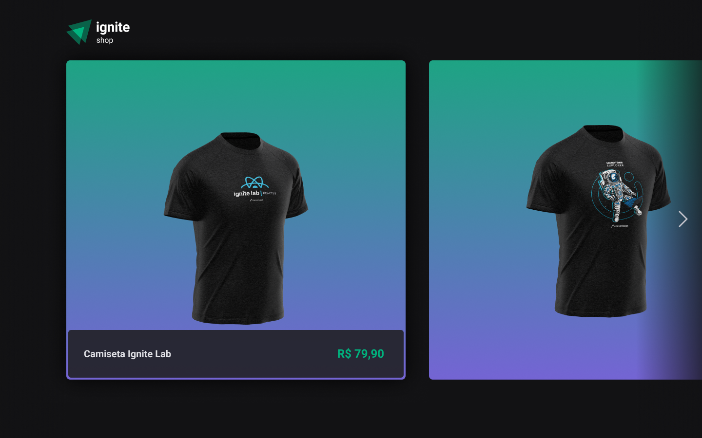
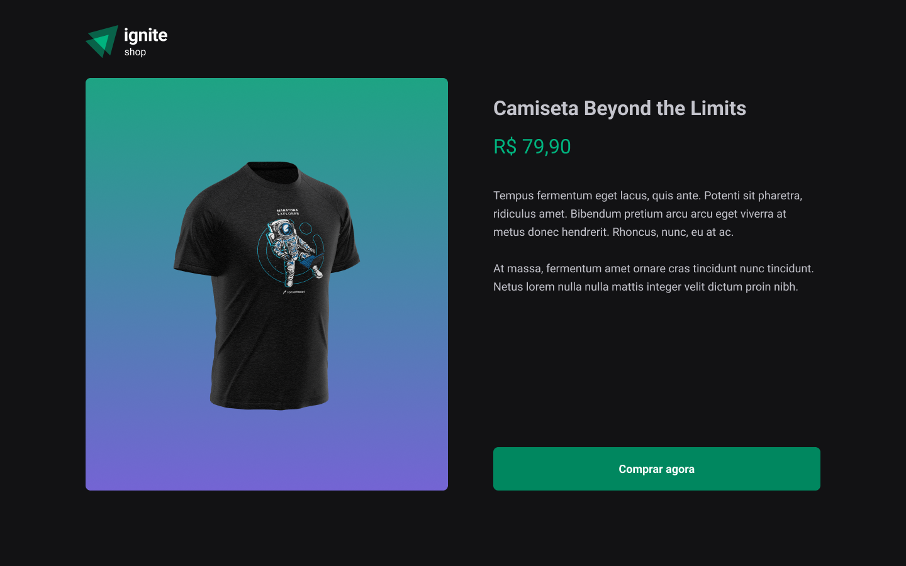
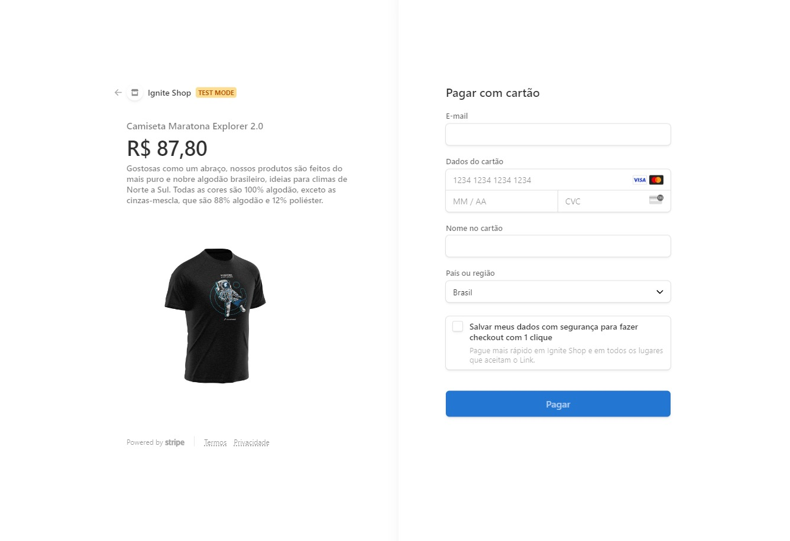

<h1 align='center'>Ignite Shop</h1>

<h2 align='center'>💻 Projeto</h2>

Aplicação de simulação de um shop de camisetas.  
Utilização do Stripe e sua API, tanto para cadastro de produtos quanto checkout 

<h2 align='center'>⚙ Tecnologias </h2>

  

<h4 align='center'>Home Page</h4>

<h4 align='center'>Product Page</h4>

<h4 align='center'>Purchase Page</h4>

<h4 align='center'>Stripe Checkout</h4>

 

Projeto do Ignite da Rocketseat
